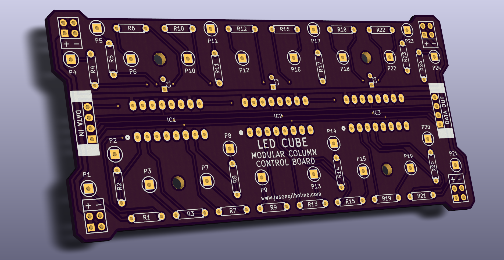
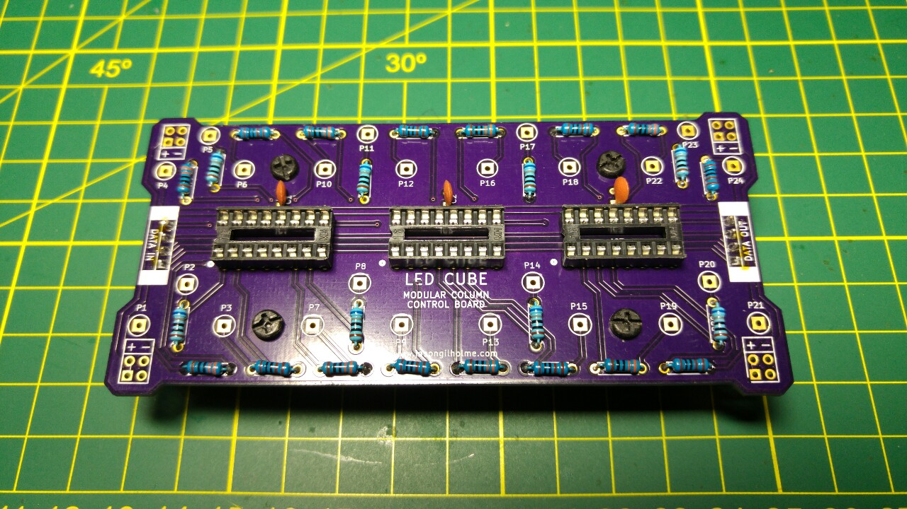
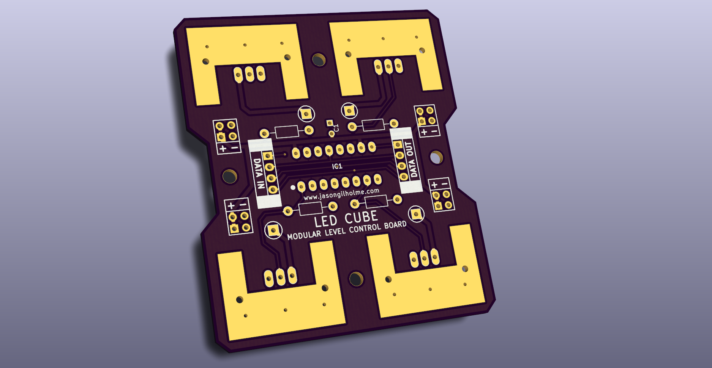

## jgLedCube

Open source software and hardware for creating an LED Cube.

### Software

The available code is intended to an SDK to allow people to make their cubes do more things as well as interact with other devices. 

The two main components of this are:

* core.cpp - intended for the cube micro controller and handles the data arrays for the cube.  It's implementation matches the provided hardware as well.
* serial.cpp - provides a standardized interface for communicating with an LED cube.  This provides higher level functions like set_led(), clear() etc to be used from Android Apps, Desktop programs and other micro controllers.

### Hardware

The hardware consists of two modular boards which are daisy chained together.  

The "column control board" acts as a base for the cube and provides 8 columns in a 4x2 arrangement.  This can be used to make arbitrary sized cubes, and shapes that aren't cubes too!

The "level control board" is used for multiplexing the different horizontal layers in the cube. It should be connected after all the column control boards.
  
  

A main controller and power solution is not provided as the requirements may vary depending on your exact product.  There are test programs for Arduino included, but it should also be possible to compile the core libs for other devices. STM32 etc.