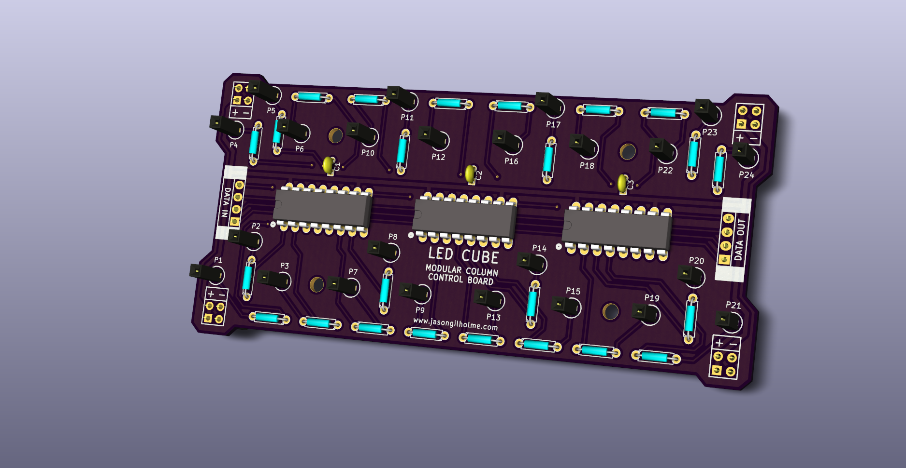
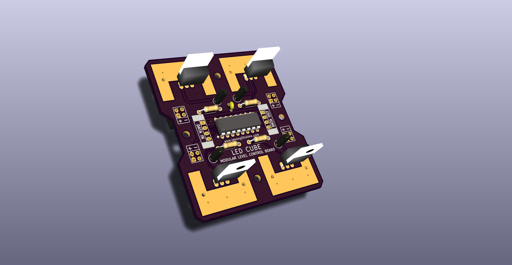

## jgLedCube

Open source software and hardware for creating an LED Cube.

### Software

The available code is intended to be more of an SDK to allow people to make their cubes do more things and interact with other devices as well. 

There are two key components to this

* core.cpp - This is intended for the cube micro controller and handles how the data is handled and the implementation matches the provided hardware
* serial.cpp - This represents a standardized interface for sending and recieving data to an LED cube.  This provides higher level functions like set_led() to be used from Android Apps, Desktop programs and other micro controllers.

### Hardware

The hardware consists of two modular boards which can be daisy chained together.  

The "column control board" acts as a base for the cube and provides 8 columns in a 4x2 arrangement.  This can be used to make arbitrary sized cubes, and shapes that aren't cubes too!

The "level control board" is used for multiplexing the different horizontal layers in the cube. It should be connect after all the column control boards.
  

  
