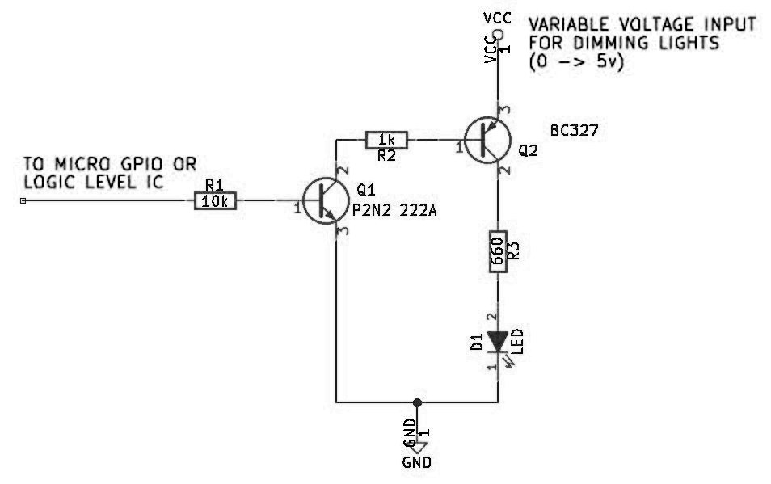
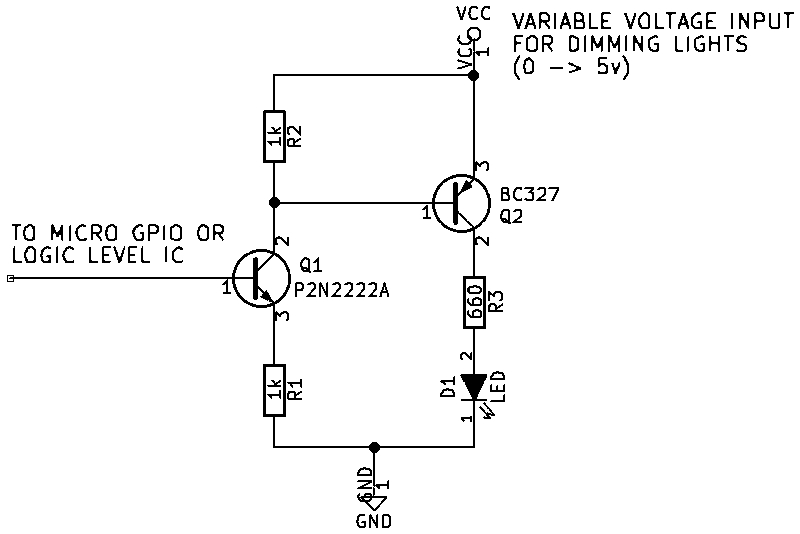
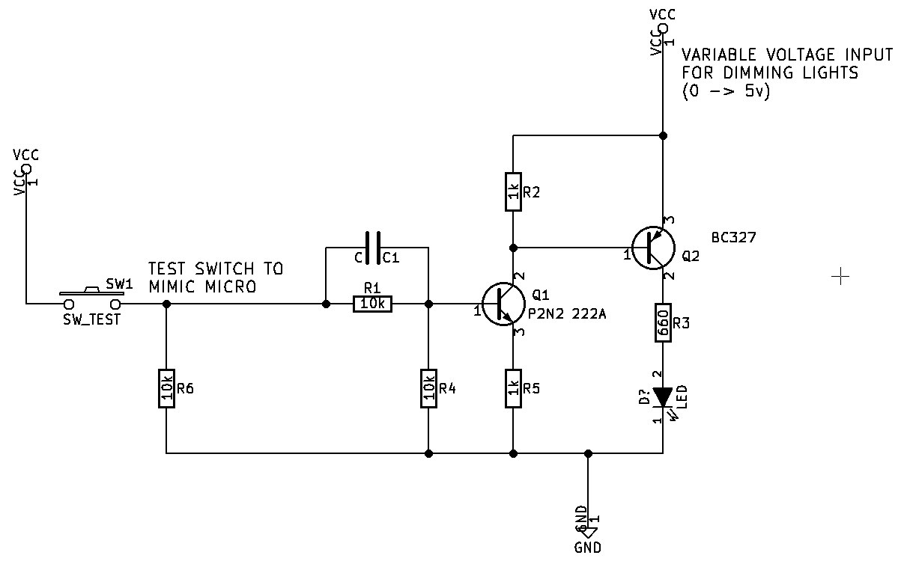

## Transistor Switch Tests

The goal here is to figure out the best way to switch the LED's to provide a solution that switches fast enough and doesn't use a lot of power.

#### Schematic 1

Found this on the internet and used it as a starting point.

Turn On:  250ns
Turn Off: Initially quick, lots of ringing

 
Schematic

 
Rise Time

 
Fall Time (Time base matches Schematic 1)

#### Schematic 2

Recommendation from EEVBlog Forum User

Turn On:  100ns
Turn Off: Initially quick. Possibly quicker than Schematic 1. Ringing gone.

 
Schematic

 
Rise Time

 
Fall Time

#### Schematic 3

Turn On:  Not measured
Turn Off: Initially quick rate.  Response time varies depending on component selection.

 
Schematic

 
Schematic 2 fall at matching time base

 
Schematic 3

 
Schematic 3 - without C1

 
Schematic 3 - without C1 and without R5

 
Schematic 3 - 1k for R1 and R4

