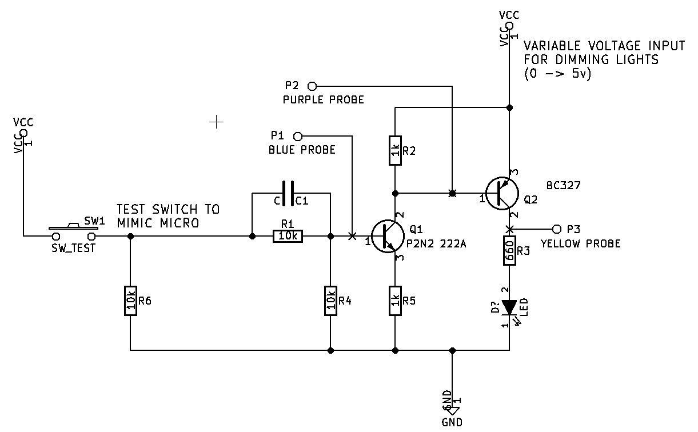

## Transistor Switch Tests

The goal here is to figure out the best way to switch the LED's to provide a solution that switches fast enough and doesn't use a lot of power.

#### Schematic 1

 
 
 

#### Schematic 2

 
 
 

#### Schematic 3

Schematic
 

 
Schematic 2 fall at matching time base

 
Schematic 3

 
Schematic 3 - without C1

 
Schematic 3 - without C1 and without R5

 
Schematic 3 - 1k for R1 and R4

